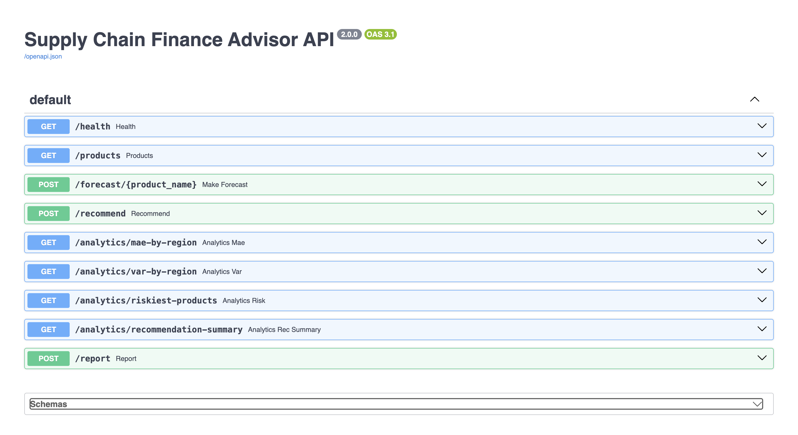
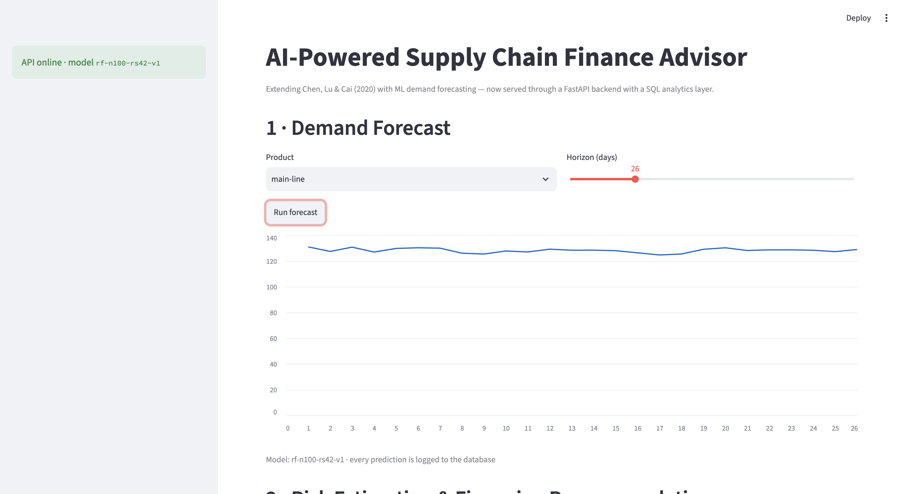
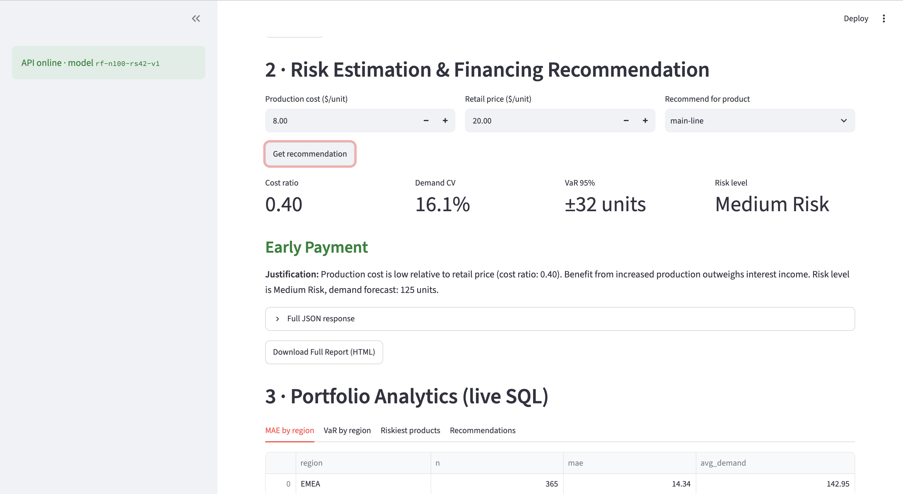
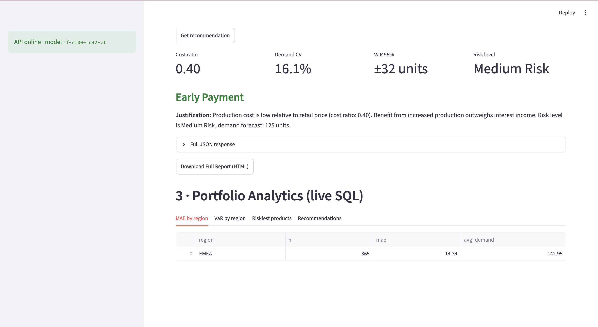

# AI-Powered Supply Chain Finance Advisor (v2)

> ML demand forecasting + risk estimation + financing recommendations,
> served through a **FastAPI** backend with a **SQL analytics layer**,
> wrapped in a **Streamlit** dashboard. Extends Chen, Lu & Cai (2020)
> with an industry-style serving architecture.

[](https://github.com/MerjenDursunova/supply-chain-finance/actions)
[](https://www.python.org/downloads/)

---

## What it does

Given a supplier's **production cost**, **retail price**, and **historical
demand**, the system:

1. **Forecasts demand** with a RandomForest model (MAE **14.36** / RMSE **17.25**
   on the held-out 2023 year), recursively, for any horizon.
2. **Estimates demand risk** — coefficient of variation → risk level →
   risk-adjusted demand → 95% Value-at-Risk of forecast error.
3. **Recommends a financing method** (Early Payment / In-House Factoring /
   Bank Financing) using the decision logic of _Chen, Lu & Cai (2020)_,
   with thresholds shifted by demand risk.
4. **Logs every prediction and every recommendation** to a SQL database,
   powering live portfolio analytics (MAE and VaR by region, riskiest
   products, recommendation history).
5. **Generates a downloadable HTML report** per recommendation.

Every model answer is reproducible from the API — and the whole system is
verifiable from the dashboard.

## Screenshots

<!-- Save your screenshots into docs/images/ with these names: -->

| API (Swagger docs)               | Forecast                                  | Recommendation                                   | Analytics                                  |
| -------------------------------- | ----------------------------------------- | ------------------------------------------------ | ------------------------------------------ |
|  |  |  |  |

## Architecture

```
Streamlit dashboard (client)  ──HTTP/JSON──►  FastAPI service (server)
localhost:8501                                localhost:8000
     ▲ renders                                    │ loads
     └────────────── JSON responses ──────────────┤
                                                   ▼
                              ┌────────────────────────────────┐
                              │  engine.py   pure decision    │
                              │  forecaster.py  RF model pkl  │
                              │  SQLite (scf.db):             │
                              │   demand_history, forecasts,  │
                              │   predictions_log             │
                              └────────────────────────────────┘
```

The dashboard holds **zero ML code** — it is a thin client. All logic
lives in the API, so any other client (script, mobile app, another team's
service) can consume the same endpoints.

## Quickstart

```bash
python -m venv venv && source venv/bin/activate
pip install -r requirements.txt
export SCF_DB=$PWD/data/scf.db
python db/seed.py                    # loads 2021–2023 demand + 365 logged forecasts
uvicorn api.main:app --port 8000     # terminal 1
streamlit run app/dashboard.py       # terminal 2 → http://localhost:8501
```

Interactive API docs: http://localhost:8000/docs

With Docker (one command, both services):

```bash
docker compose up --build
```

## API

| Method | Endpoint                            | Description                                                                                     |
| ------ | ----------------------------------- | ----------------------------------------------------------------------------------------------- |
| GET    | `/health`                           | service + model version check                                                                   |
| GET    | `/products`                         | catalogue from the database                                                                     |
| POST   | `/forecast/{product}?horizon=N`     | recursive forecast; `backtest=true` (default) scores the last N historical days and returns MAE |
| POST   | `/recommend`                        | full risk + financing recommendation (JSON, includes rationale)                                 |
| POST   | `/report`                           | same recommendation rendered as downloadable HTML                                               |
| GET    | `/analytics/mae-by-region`          | MAE per region, computed in SQL over logged forecasts                                           |
| GET    | `/analytics/var-by-region`          | 95th-percentile forecast error per region (nearest-rank, in SQL)                                |
| GET    | `/analytics/riskiest-products`      | products ranked by demand CV                                                                    |
| GET    | `/analytics/recommendation-summary` | audit log of recommendations                                                                    |

Example:

```bash
curl -X POST localhost:8000/recommend -H 'Content-Type: application/json'   -d '{"product": "main-line", "production_cost": 10, "retail_price": 20}'
```

## Project structure

```
├── api/            FastAPI service, pure decision engine, SQL layer, HTML report
├── app/            Streamlit dashboard (API client)
├── db/             schema.sql + seed.py (real data → SQLite)
├── data/           historical_demand.csv (2021–2023), forecast_results.csv
├── models/         demand_forecast_model.pkl (RandomForest, n=100, rs=42)
├── tests/          engine unit tests + API integration tests (pytest)
├── docs/           REPORT.md — full methodology deep-dive
├── Dockerfile.api / Dockerfile.app / docker-compose.yml
└── .github/workflows/ci.yml
```

## Methodology (in brief)

- **Data**: 3 years of daily demand (2021–2023); train = 2021–22, test = 2023.
- **Model**: RandomForest on calendar + lag/rolling features
  (`day_of_year, month, quarter, year, day_of_week, lag_1/7/30,
rolling_mean_7/30` — all causal, `shift(1)`).
- **Risk**: CV bands at 0.10/0.20 → Low/Medium/High; risk-adjusted demand =
  mean ± 0.5σ (Low +, High −); VaR 95 = percentile of absolute forecast errors.
- **Decision**: cost ratio ≤ 0.40 (+risk modifier) → Early Payment;
  ≤ 0.70 (+modifier) → In-House Factoring; else Bank Financing.

Full field-by-field explanation: **[docs/REPORT.md](docs/REPORT.md)**.

## Tests

```bash
python -m pytest tests/ -v
```

## Known limitations

- Single product/region in the shipped dataset (schema supports more).
- Recursive multi-step forecasts drift toward the mean for long horizons.
- Model artifact requires the scikit-learn version it was trained with
  (pin in `requirements.txt`).

## Reference

Chen, X., Lu, Q., & Cai, G. (2020). _Buyer Financing in Pull Supply Chains:
Zero-Interest Early Payment or In-House Factoring?_ Production and
Operations Management.
